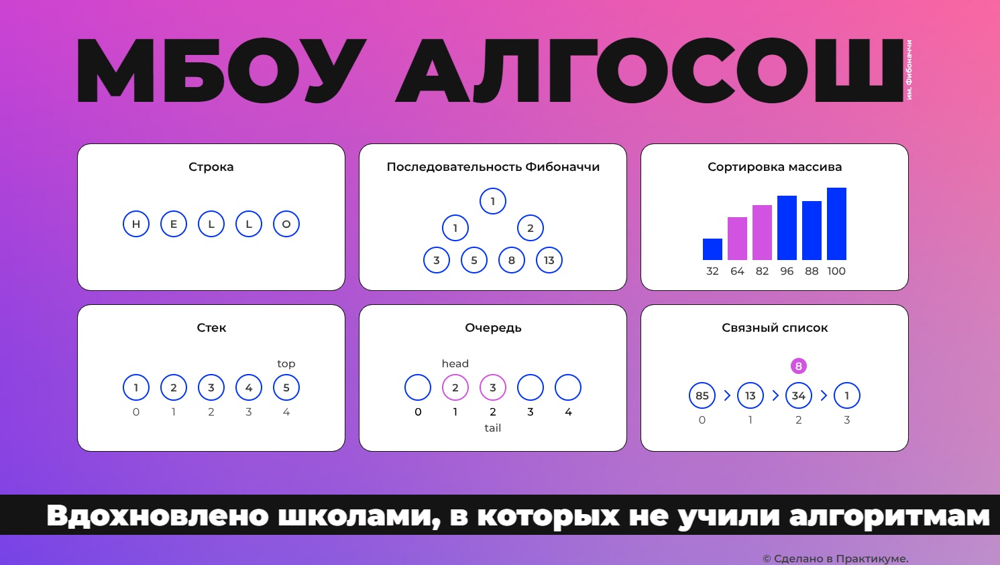
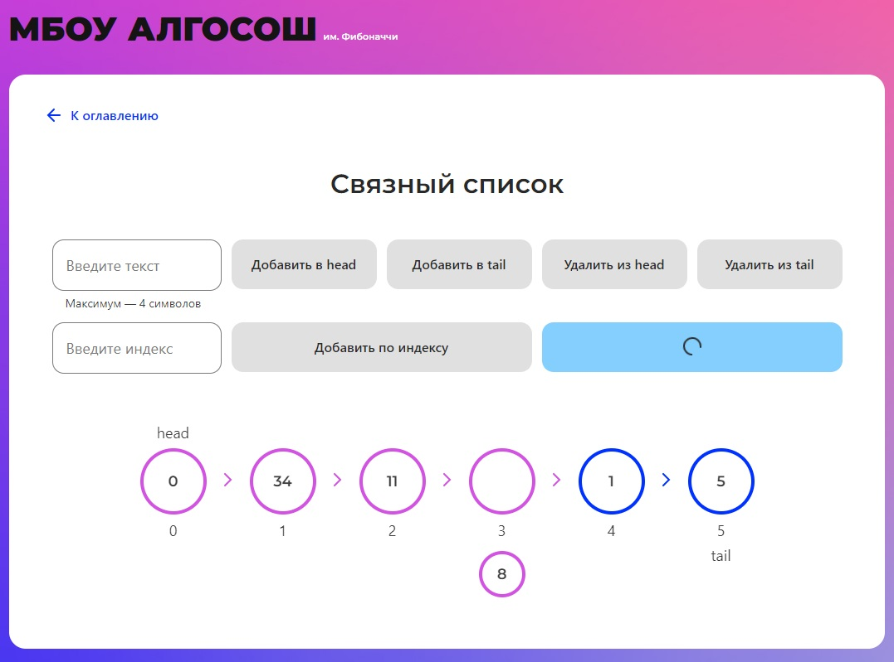

# Проектная работа. МБОУ АЛГОСОШ им. Фибоначчи
Визуализация работы алгоритмов и операций со структурами данных [Перейти на сайт](https://r2u1s.github.io/algososh/) 

## Технологии
* React
* JS, JSX
* Вёрстка без адаптивности
### Функциональность
Реализована визуализация следующих алгоритмов:
* Разворачивание строки методом двух указателей;
* Поиск n-ого числа ряда Фибоначчи;
* Сортировка массива методом пузырька;
* Сортировка массива выбором;

Также реализована визуализация операций со структурами данных:
* Стэк;
* Очередь;
* Связанный список
#### Проект
выполнен в рамках учебного курса "Веб-разработка" Яндекс.Практикума
##### Макет Figma
[Можно посмотреть здесь](https://www.figma.com/file/RIkypcTQN5d37g7RRTFid0/Algososh_external_link?node-id=0%3A1)